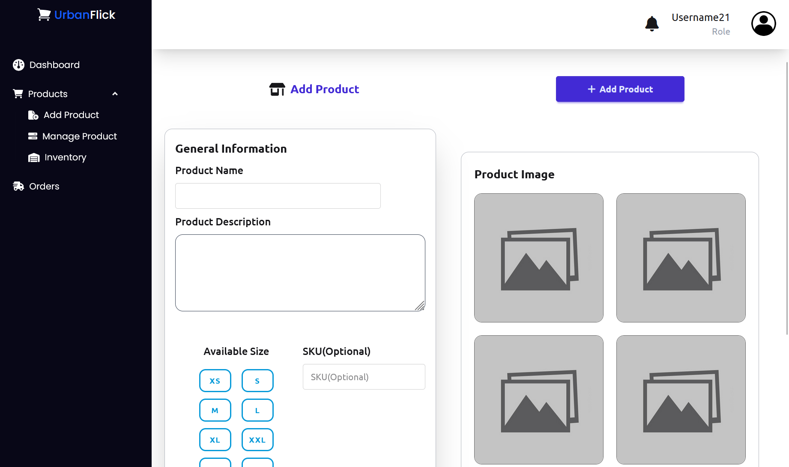
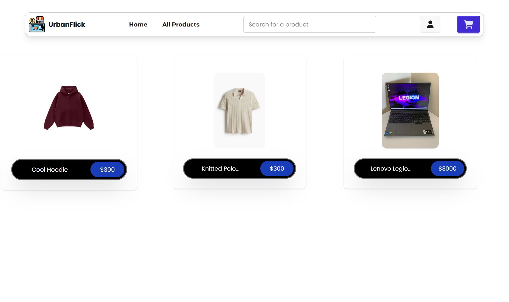
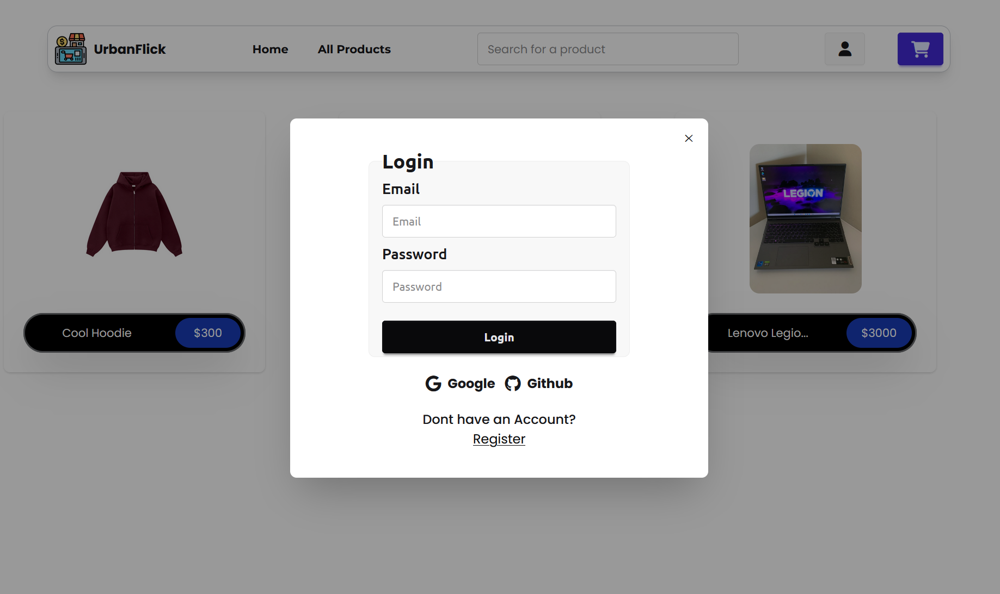
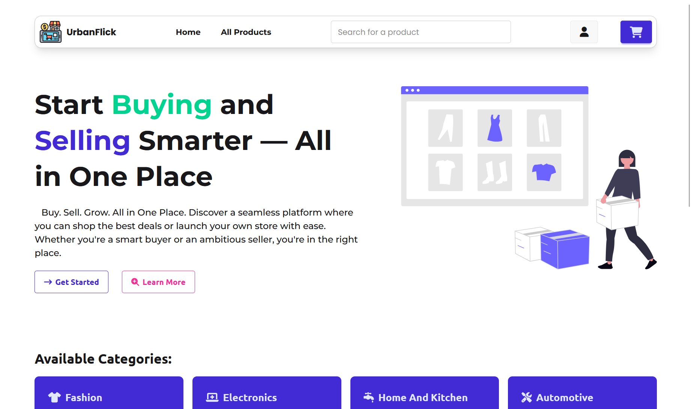
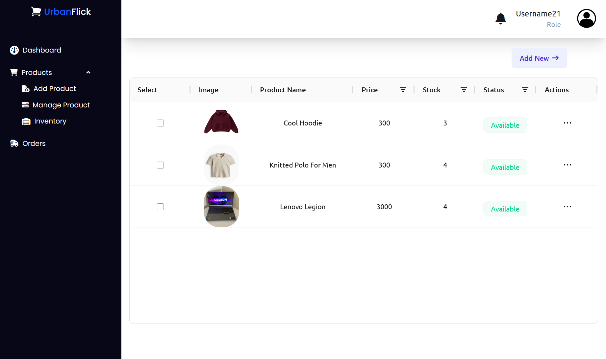
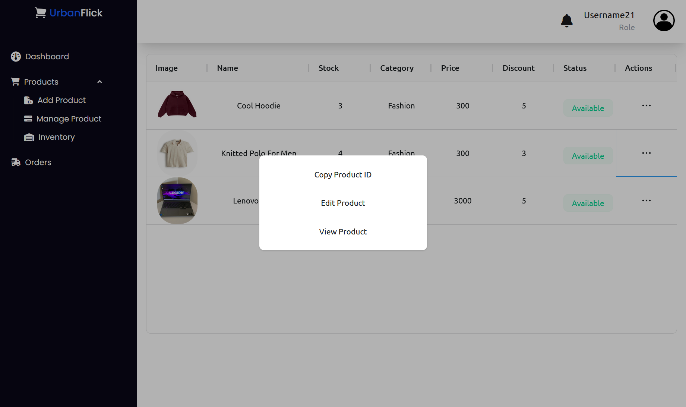
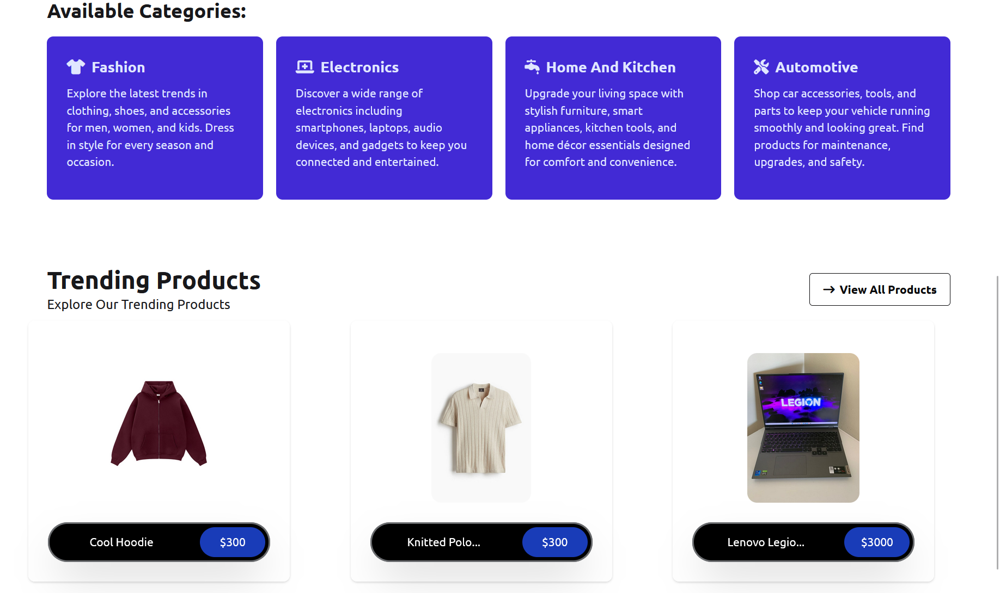

# 🛍️ UrbanFlick

> Buy, Sell, Grow — All in One Place.  
> UrbanFlick is a modern e-commerce platform where users can browse products, explore categories, and shop with ease. Sellers can manage their inventory and track orders with a simple, intuitive dashboard. Designed with React and Tailwind CSS, UrbanFlick ensures a fast and seamless online shopping experience.

⚠️ **Note:** This project is still **incomplete** and currently **under active development**. Some features may be missing or not fully functional.

## 🧷 Live Demo

👉 [View Website](https://your-vercel-link.vercel.app/)

## 🌐 Preview

  
  

## 🛠️ Built With

- **Technologies:** React.js, JavaScript, Tailwind CSS
- **Backend:** Node.js / Express.js (for token routes)
- **Database:** Firebase
- **Hosting:** Vercel (frontend) Render (backend)

## ⭐ Features

- 🏠 **Homepage with Categories** – Explore fashion, electronics, home, and more.
- 🛒 **Product Browsing** – View all available products with details and pricing.
- 🔍 **Search Functionality** – Quickly find products by name.
- 👤 **User Authentication (Planned)** – Secure login and profile system.
- 📦 **Seller Dashboard** – Manage products, inventory, and orders.
- 💳 **Cart & Checkout (Planned)** – Seamless shopping experience.

## 🙏 Credits

This project is built as part of my learning journey in React and modern web development.  
Special thanks to open-source resources and the dev community for guidance and inspiration.

## 💼 Open for Commission

I’m currently available for freelance work—especially building modern web apps and e-commerce platforms!  
Feel free to reach out through the platforms below:

- 📘 [Facebook](https://www.facebook.com/windyl.monton.3)
- 📷 [Instagram](https://www.instagram.com/devwindyl/)
- 💻 [GitHub](https://github.com/Arch-ZeroOne)
